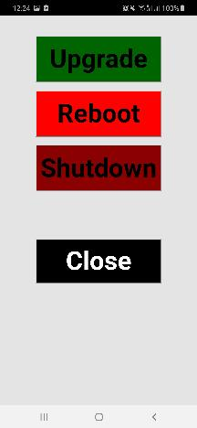

# androidSSHSimple

Simple ssh android application example using web programing languages.

## Setup enviroment

### Setup android enviroment

Install Android stuff based on this guide (I wish you a lot of patience): [Android](https://cordova.apache.org/docs/en/latest/guide/platforms/android/)

### Install application dependencies inside this folder

`cordova platform add android`

Install all cordova plugins mentioned in package.json

## Build and run in connected device

`cordova run android --device`

## App layer

Take a look into www/index.html, www/css/index.css, www/js/index.js and www/js/config.js

## Expected behavior

You will see in your device 2 buttons. Connect and Close. Press Connect three buttons show (if connection was etablished, otherwse application will be closed. Setup config.js first!!!!). Map actions for buttons as you wish.

Please be patiente when executing commands. It can takes time based on command. E.g. try reboot cmd first.

Home

After connect

